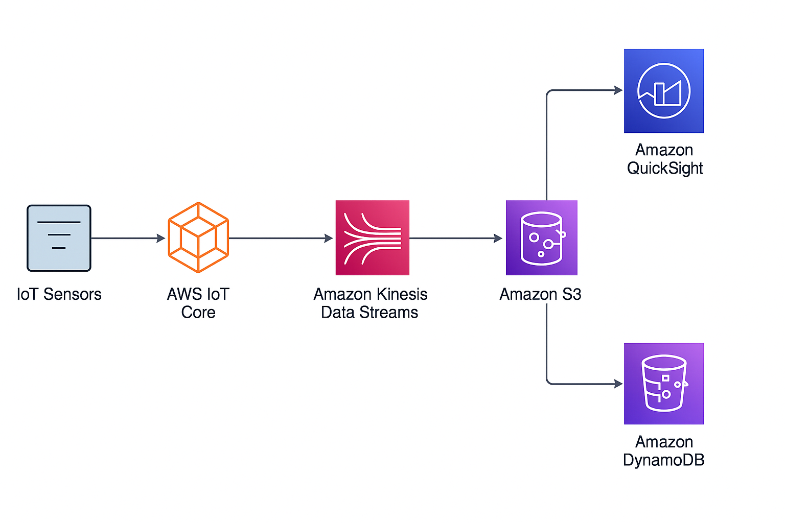

# 🏭 Real-Time Factory Data Streaming System on AWS

## 🔍 Business Background
In traditional manufacturing settings, monitoring temperature, gas flow, or vibration relies heavily on manual checks or local data logging. This creates delays in anomaly detection, reducing efficiency and increasing the risk of downtime.

This project proposes an AWS-based architecture that enables real-time data streaming, analysis, and visualization — optimized for industrial applications like gas supply monitoring or equipment maintenance.

## 🎯 Objectives
- Real-time ingestion of IoT sensor data (e.g. pressure, temperature)
- Stream processing and simple alerting logic
- Centralized storage and analysis dashboard

## ☁️ AWS Services Used
| Component | Service |
|----------|---------|
| Device Connectivity | AWS IoT Core |
| Data Stream | Amazon Kinesis Data Stream |
| Real-time Processing | AWS Lambda |
| Data Storage | Amazon S3, DynamoDB |
| Visualization | Amazon QuickSight |
| Permissions | AWS IAM |

## 📐 Architecture Diagram
  
_A simple IoT → Kinesis → Lambda → Storage → Dashboard flow_

## 🚀 Deployment Plan (Coming Soon)
- Create IoT Thing / Rule
- Setup Kinesis stream
- Configure Lambda for data transformation
- Store in DynamoDB or S3
- Connect QuickSight for dashboard

## 💡 Why This Matters
By combining AWS services, we can:
- Reduce manual inspection time
- Enable real-time alerts for anomaly detection
- Centralize data for long-term optimization
- Improve system scalability and reduce maintenance effort

## 👤 Author
Adam Lin  
Industrial Product PM | AWS Learner | Passionate about cloud transformation for manufacturing  
📧 adam.lg.lin@gmail.com  
🔗 [LinkedIn](https://www.linkedin.com/in/adamlin1003/) • [GitHub](https://github.com/adamlglin)
